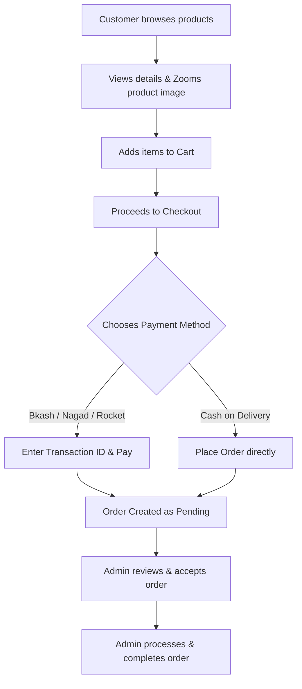

# DorkarBuy.shop - E-Commerce Platform

A premium, modern e-commerce platform built with Laravel 13, Filament v5, Inertia.js, and React. Optimized for selling books, courses, and digital/physical products with automated branding styling controls, multiple local payment gateways, and a complete order tracking system.

---

## 🛠️ Tech Stack & Architecture

- **Backend Framework:** Laravel 13 (PHP 8.3+)
- **Admin Panel & Operations:** Filament v5 (using the Schema engine)
- **Frontend SPA Layer:** Inertia.js (React 19)
- **Styling Engine:** Tailwind CSS v4 (supporting dynamic theme overrides via CSS variables)
- **Build System:** Vite

---

## 📊 Complete System Workflows



### 1. 🛒 Customer Frontend Workflow & Pages

The frontend is built as a lightning-fast Single Page Application (SPA) using React 19 and Inertia.js. Below is the page-by-page workflow for customers:

#### A. Homepage (`Home.jsx`)
- **Hero Carousel:** Interactive slideshow showcasing promotional slides (loaded dynamically from Sliders Resource in Admin).
- **Category Grid:** Visual department navigator to browse items by Category.
- **Featured Tabs:** Dynamically categorizes products into tabs (e.g. Featured Books, Trending Courses, Latest releases) for quick browsing.
- **Dynamic Hotline:** Shows the active admin-configured phone number dynamically in both the main header and footer, allowing customers to click-to-call.

#### B. Product Catalog (`Products.jsx`)
- Displays all active items in a responsive grid.
- **Search Bar:** Real-time search by product title.
- **Sidebar Filters:** Filter catalog dynamically by selected categories.

#### C. Product Details (`ProductDetail.jsx`)
- Detailed display of product description, ratings, default pricing, and active sale prices.
- **Interactive Image Preview:** Non-book products (e.g. gadgets, accessories) support clicking on the product image to launch a full-screen interactive modal where users can zoom in and out.
- **CTA Actions:** Quick buttons for "Add to Cart" and "Buy Now" (which automatically adds the item and redirects directly to Checkout).
- **Stock Status:** Dynamic display of inventory indicators ("In Stock" vs. "Out of Stock").

#### D. Shopping Cart Page (`Cart.jsx`)
- Lists items currently added to the cart, showing product thumbnail, title, and price.
- **Quantity Modifiers:** Inline `+` and `-` buttons that recalculate product subtotals instantly using local state.
- **Dynamic Pricing Summary:** Dynamic sidebar reflecting Subtotal, shipping rates, and the estimated Grand Total.
- **Visual Branding Adaptation:** Cart page colors (backgrounds, buttons, hover text) adapt dynamically to the color values configured in the Admin Panel Theme Settings.

#### E. Shipping & Checkout (`Checkout.jsx`)
- Comprehensive checkout form capturing Name, Phone, Email, Address, and City.
- **Shipping Calculator:** Allows choosing between "Inside Dhaka" or "Outside Dhaka", which automatically recalculates shipping fees and updates the order Grand Total on the fly.
- Shows a list of order items for final verification.

#### F. Payment Gateway (`Payment.jsx`)
- Displays payment instructions tailored to the chosen method:
  - **Mobile Financial Services (bKash, Nagad, Rocket):** Displays the dynamic admin-defined account number and payment instructions (Send Money / Payment). Customers input their MFS sender account number and the **Transaction ID** generated by the payment app.
  - **Cash on Delivery:** Provides confirmation instructions.
- Includes dynamic orange-themed Toast Notifications to give instant success/error feedback on submission.

#### G. Customer Accounts & Identity (`Auth/`)
- **Login (`Login.jsx`):** Secure email-based authentication screen.
- **Registration (`Register.jsx`):** Simple registration flow for new users.
- **User Profile (`Profile.jsx`):** Custom settings where logged-in customers can view and edit their profile details (Name, default Phone, shipping Address).

#### H. Dashboard & Orders Tracking (`Dashboard.jsx` & `Orders/`)
- **Dashboard (`Dashboard.jsx`):** Quick dashboard console showing account status and shortcut links.
- **Orders List (`Orders/Index.jsx`):** Logs all customer purchases with purchase dates, order totals, current Order Status (Pending, Processing, Completed, Cancelled), and Payment Status (Paid/Unpaid).
- **Invoice & Progress Tracker (`Orders/Show.jsx`):** Displays a detailed receipt invoice of the order, payment logs, and a visual progress bar indicating exactly where the order is in the shipping/validation pipeline.

#### I. Custom Static Pages (`Page.jsx`)
- Dynamically renders markdown/text pages (e.g. Terms of Service, Privacy Policy, About Us) configured by the admin in general settings.

---

### 2. ⚙️ Admin Panel Workflow (Filament)

Admins control the entire store lifecycle through a clean, intuitive Filament v5 backend dashboard. Below is the detailed resource-by-resource workflow:

#### A. Dashboard Analytics & Monitoring
- **Default Path:** `/admin`
- **Widgets & Statistics:**
  - **Total Revenue:** All-time sum of completed payments, formatted in BDT.
  - **Today Revenue:** Total completed payments processed today, letting admins gauge daily performance.
  - **Total Orders:** Tracks order volume, displaying a breakdown badge of how many orders are currently `pending` and need immediate validation.
  - **Completed Orders:** Total number of successfully fulfilled orders.
  - **Active Products:** Number of products currently active and visible to customers on the frontend.

#### B. Catalog Management (Categories, Products & Sliders)
- **Sliders Resource (`/admin/sliders`):**
  - Admins upload and manage marketing banners for the frontend homepage carousel.
  - Form attributes include: Title, Subtitle, Banner Image, redirect Link (e.g. to a specific campaign or product), Sort order, and Active status checkbox.
- **Categories Resource (`/admin/categories`):**
  - Setup store departments (e.g., academic books, engineering, web development courses).
  - Form attributes include: Category Title, auto-generated URL Slug, cover Image, Description, and Active toggle.
- **Products Resource (`/admin/products`):**
  - Manage books, courses, or physical goods.
  - Form attributes include: Product Title, Slug, primary Cover Image, detailed Description, Price, Sale Price, Type selector (e.g., `book` or `course`), stock quantity, active status checkbox, and featured toggle.
  - Items classified under type `course` will exclude image-zooming triggers on the frontend, while other item types enable the zooming modal automatically.

#### C. Customers & Security (Users Management)
- **Users Resource (`/admin/users`):**
  - Manage accounts for both system administrators (with panel access) and customer portals.
  - Form attributes include: Name, Email, Role definition, Password assignment, and Active/Block toggles.

#### D. Sales Operations (Orders & Payments Validation)
- **Orders Resource (`/admin/orders`):**
  - List and inspect all purchases made on the frontend.
  - Details include: Customer contact info (Name, Phone, shipping Address), list of purchased items, subtotal, and selected payment method.
  - Admins update order progress through state transitions: `Pending` ➡️ `Processing` ➡️ `Completed` (or `Cancelled`).
- **Payments Resource (`/admin/payments`):**
  - Records payment transactions submitted by customers.
  - Fields include: Selected Payment Method (bKash, Nagad, Rocket, COD), payment amount (BDT), customer's sender Phone number, customer-submitted **Transaction ID**, and status dropdown (`pending`, `completed`, `failed`).
  - **Validation Loop:** Admins verify the Transaction ID against their merchant account statement, then mark the payment as `completed`, which updates the order context.

#### E. General Configuration (Settings & Payment Methods)
- **Payment Methods Resource (`/admin/payment-methods`):**
  - Setup payment accounts for MFS.
  - Admins input/edit the active merchant/agent account numbers for **bKash, Nagad, and Rocket**.
  - Includes toggles to instantly enable or disable payment methods globally (e.g. disabling Rocket during maintenance, or enabling Cash on Delivery).
- **Settings Resource (`/admin/settings`):**
  - Configure global site metadata:
    - **Branding:** Site Name (English & Bangla Translation), logo, and favicon upload.
    - **Hotline Support:** Dynamic hotline phone number (e.g., `01914383816`) that dynamically propagates to the frontend Header and Footer, ensuring easy contact updates.

#### F. Branding Styling Control (Theme Settings)
- **Theme Settings Page (`/admin/theme-settings`):**
  - A dedicated interface equipped with color pickers that instantly changes the platform's visual identity:
    - **Primary Brand Color:** Modifies the primary CTA buttons, badges, highlights, and icons (Default: `#ea580c`).
    - **Hover Color:** Sets the dark hover state for active components (Default: `#c2410c`).
    - **Body Background Color:** Alters the background of main pages and layouts.
    - **Primary Text Color:** Sets typography color.
  - Changes compile instantly via CSS custom properties mapped to Tailwind CSS v4, requiring no manual coding or server recompiles.

---

## 🚀 Getting Started

### Prerequisites
- PHP 8.3 or higher
- Composer 2.x
- Node.js (v18+) & NPM

### Setup & Installation

1. **Clone the repository & enter workspace:**
   ```bash
   git clone https://github.com/mdkhairul773islam/dorkarbuy.shop.git
   cd dorkarbuy.shop
   ```

2. **Install backend packages:**
   ```bash
   composer install
   ```

3. **Install frontend packages:**
   ```bash
   npm install
   ```

4. **Environment Configuration:**
   ```bash
   cp .env.example .env
   php artisan key:generate
   ```

5. **Database setup (Setup your DB credentials in `.env` first):**
   ```bash
   php artisan migrate --seed
   ```

6. **Compile frontend assets:**
   ```bash
   npm run build
   ```

7. **Run local server:**
   ```bash
   php artisan serve
   ```
   Open `http://127.0.0.1:8000` to view the website, or `http://127.0.0.1:8000/admin` to access the Admin Panel.

---

## ⚡ Key Development & Maintenance Commands

- **Code Formatting (Pint):** Ensure all PHP files align with codebase standards.
  ```bash
  vendor/bin/pint --dirty --format agent
  ```
- **Vite Bundling:** Build assets whenever React templates (`.jsx`) or styles (`.css`) are changed.
  ```bash
  npm run build
  ```
