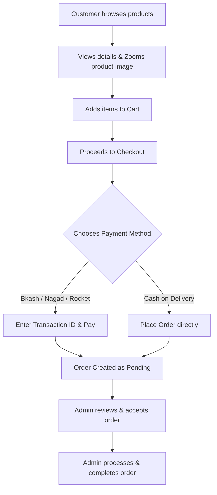

# DorkarBuy.shop - E-Commerce Platform

A premium, modern e-commerce platform built with Laravel 13, Filament v5, Inertia.js, and React. Optimized for selling books, courses, and digital/physical products with automated branding styling controls, multiple local payment gateways, and a complete order tracking system.

---

## 🛠️ Tech Stack & Architecture

- **Backend Framework:** Laravel 13 (PHP 8.3+)
- **Admin Panel & Operations:** Filament v5 (using the Schema engine)
- **Frontend SPA Layer:** Inertia.js (React 19)
- **Styling Engine:** Tailwind CSS v4 (supporting dynamic theme overrides via CSS variables)
- **Build System:** Vite

---

## 📊 Complete System Workflows



### 1. 🛒 Customer Frontend Workflow

#### A. Browse & Inspect Products
- Customers can filter books, courses, and other items by category.
- **Image Zooming Feature:** For products other than books, users can click on the product card or detail image to open an interactive modal and zoom in/out to inspect details.

#### B. Cart Management
- Access the cart via the header or direct link (`/cart`).
- Dynamically adjust item quantities or delete products.
- Color combinations, backgrounds, and action buttons in the cart adapt automatically to the custom brand identity set in the admin panel.

#### C. Checkout & Shipping Details
- Customers fill in shipping forms (Name, Email, Address, City).
- Displays a summary of the order with automatic subtotal calculation.

#### D. Payment Gateway Integration
- Customers select from:
  - **Mobile Financial Services (MFS):** bKash, Nagad, Rocket. Shows the admin-configured payment numbers dynamically. Requires a Transaction ID from the MFS app.
  - **Cash on Delivery (COD).**
- Clicking "Place Order" completes the transaction and redirects users to their personal dashboard.

#### E. Order Tracking & Dashboard
- Dashboard lists order histories, payment status (Paid/Unpaid), and shipment progress.
- Clean profile options allow updating contact details.

---

### 2. ⚙️ Admin Panel Workflow (Filament)

#### A. Order & Transaction Validation
- **Path:** `/admin/orders`
- Admins verify incoming orders, check the provided **Transaction ID** against their merchant statements, and transition the order state:
  - `Pending` ➡️ `Processing` ➡️ `Completed` / `Cancelled`.

#### B. Dynamic General Settings
- **Path:** `/admin/settings`
- Configure global text/details:
  - Site name & Bangla Translation.
  - Merchant logos & Favicons.
  - Dynamic **Hotline Numbers** shown across the site (Header & Footer).
  - Individual MFS account numbers (bKash, Nagad, Rocket).

#### C. Visual Branding Control (Theme Settings)
- **Path:** `/admin/theme-settings`
- An admin-friendly, dedicated styling page with color pickers to instantly repaint the website:
  - **Primary Brand Color:** Changes primary buttons, highlights, tags, and icons (Default: `#ea580c`).
  - **Hover Color:** Defines interactive hover states for CTA buttons.
  - **Body Background Color:** Sets main layouts (`bg-slate-50`, body, container panels).
  - **Primary Text Color:** Controls typography color contrast.
- All styles compiled dynamically via Tailwind v4 variables and modern CSS `color-mix()` for light background tints (e.g. `orange-50` and `orange-100`).

---

## 🚀 Getting Started

### Prerequisites
- PHP 8.3 or higher
- Composer 2.x
- Node.js (v18+) & NPM

### Setup & Installation

1. **Clone the repository & enter workspace:**
   ```bash
   git clone https://github.com/mdkhairul773islam/dorkarbuy.shop.git
   cd dorkarbuy.shop
   ```

2. **Install backend packages:**
   ```bash
   composer install
   ```

3. **Install frontend packages:**
   ```bash
   npm install
   ```

4. **Environment Configuration:**
   ```bash
   cp .env.example .env
   php artisan key:generate
   ```

5. **Database setup (Setup your DB credentials in `.env` first):**
   ```bash
   php artisan migrate --seed
   ```

6. **Compile frontend assets:**
   ```bash
   npm run build
   ```

7. **Run local server:**
   ```bash
   php artisan serve
   ```
   Open `http://127.0.0.1:8000` to view the website, or `http://127.0.0.1:8000/admin` to access the Admin Panel.

---

## ⚡ Key Development & Maintenance Commands

- **Code Formatting (Pint):** Ensure all PHP files align with codebase standards.
  ```bash
  vendor/bin/pint --dirty --format agent
  ```
- **Vite Bundling:** Build assets whenever React templates (`.jsx`) or styles (`.css`) are changed.
  ```bash
  npm run build
  ```
